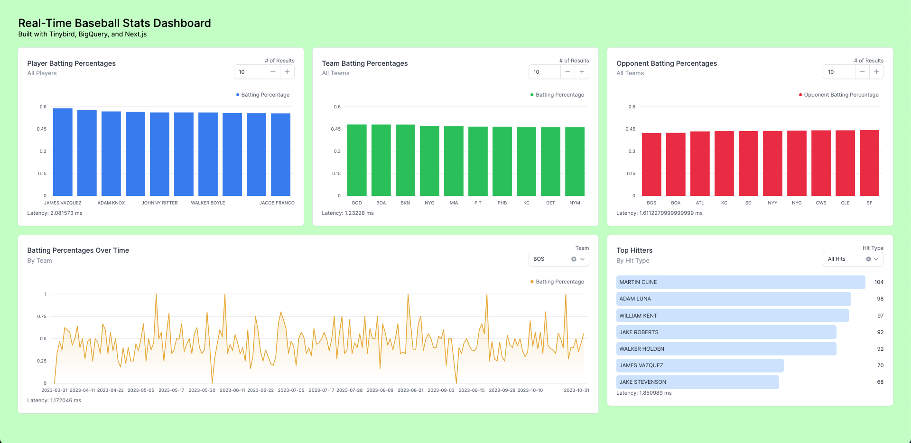

# Build a real-time dashboard over BigQuery

This project includes all of the resources necessary to build a real-time dashboard over a BigQuery table. This project uses Tinybird as a real-time analytics layer over BigQuery that exposes dashboard metrics as low-latency APIs which are consumed by a Next.js frontend.

## Prerequisites

- A BigQuery project
- The ability to add a `BigQuery Data Viewer` permission to that project
- A BigQuery table (you can create one from the included [CSV](/baseball_stats.csv))
- Python >=3.8
- Node.js

## Instructions

### 1. Set up a free Tinybird Workspace

Navigate to [tinybird.co/signup](https://www.tinybird.co/signup) and create a free account. Create a new Workspace called `bigquery_dashboard` (or name it whatever you want).

### 2. Clone the repository

```bash
git clone https://github.com/tinybirdco/bigquery-dashboard.git
cd bigquery-dashboard
```

### 3. Install the Tinybird CLI

```bash
python -mvenv .e
. .e/bin/activate
pip install tinybird-cli
```

### 4. Authenticate to Tinybird

Copy your user admin token from [ui.tinybird.co/tokens](https://ui.tinybird.co/tokens). Your user admin token is the token with the format `admin <your email address>`.

In the Tinybird CLI, run the following command

```bash
cd data-project
export TB_TOKEN=<your user admin token>
tb auth
```

If you intend to push this to your own repo, add the `.tinyb` file to your `.gitignore`, as it contains your user admin token.

```bash
echo ".tinyb" >> .gitignore
```

### 5. Set up your connection to BigQuery

In this step, you'll authorize Tinybird to read data from your BigQuery project.

```bash
cd data-project
tb connection create bigquery
#** Log into your Google Cloud Platform Console as a project editor and go to https://console.cloud.google.com/iam-admin/iam
#** Grant access to this principal: <your-unique principal>
#** Assign it the role "BigQuery Data Viewer"
#Ready?  (y, N) [N]: y
#** Connection bigquery created successfully!
```

### 6. Create a table in your BigQuery project

Use the [included CSV file](/baseball_stats.csv) or use an existing table. Keep in mind that if you're using an existing BigQuery table, you'll need to create a new Data Source schema definition and updated your Pipes to match. That means everything from here on out will need to be customized to your unique setup.

> Note that if you're using your own BigQuery table, then it might be easier to create the Data Source using the [BigQuery Connector](https://www.tinybird.co/docs/ingest/bigquery.html) in the Tinybird UI.

### 7. Update `baseball_game_stats.datasource` with your BigQuery details

If you're using the included CSV, you can leave the column definitions alone. Update the BigQuery definition as follows:

```bash
IMPORT_SERVICE 'bigquery'
IMPORT_SCHEDULE '0 0 */1 * *' # <- This determines how often your BigQuery table syncs to Tinybird
IMPORT_STRATEGY 'replace'
IMPORT_EXTERNAL_DATASOURCE '<your bigquery project>.<your bigquery dataset>.<your bigquery table>'
```

### 8. Push the resources to your Tinybird Workspace

```bash
cd data-project
tb push --force
```

> Note that depending on the frequency of the Cron schedule you set in the previous step, you may need to force an initial sync with BigQuery. To do so, go to [ui.tinybird.co](https://ui.tinybird.co), find your Data Source (called `baseball_game_stats`), click the three dots in the upper right hand corner, and select "Sync Now".


### 9. Authorize your Next app to read from Tinybird APIs

You'll need to add some local environment variables to allow your Next.js app to read from Tinybird's APIs. Add the following to `.env.local`:

```bash
NEXT_PUBLIC_TINYBIRD_HOST=api.tinybird.co #OR api.us-east.tinybird.co
NEXT_PUBLIC_TINYBIRD_TOKEN=<your user admin token>
```

### 10. Run the app

```
npm run dev
```

Open http://localhost:3000 and you should see this:



Notice the latencies of the API requests. They should be very small (<5 ms depending on your network).

---

## Contributing

If you find any issues or have suggestions for improvements, please submit an issue or a [pull request](https://github.com/tinybirdco/bigquery-dashboard/pulls?q=is%3Apr+is%3Aopen+sort%3Aupdated-desc).

## License

This code is available under the MIT license. See the [LICENSE](https://github.com/tinybirdco/bigquery-dashboard/blob/main/LICENSE.txt) file for more details.

## Need help?

&bull; [Community Slack](https://www.tinybird.co/join-our-slack-community) &bull; [Tinybird Docs](https://docs.tinybird.co/) &bull;

## Authors

- [Cameron Archer](https://github.com/tb-peregrine)
